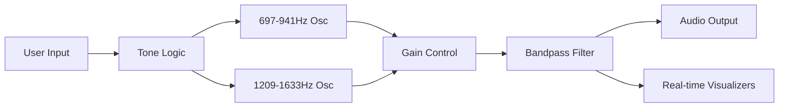
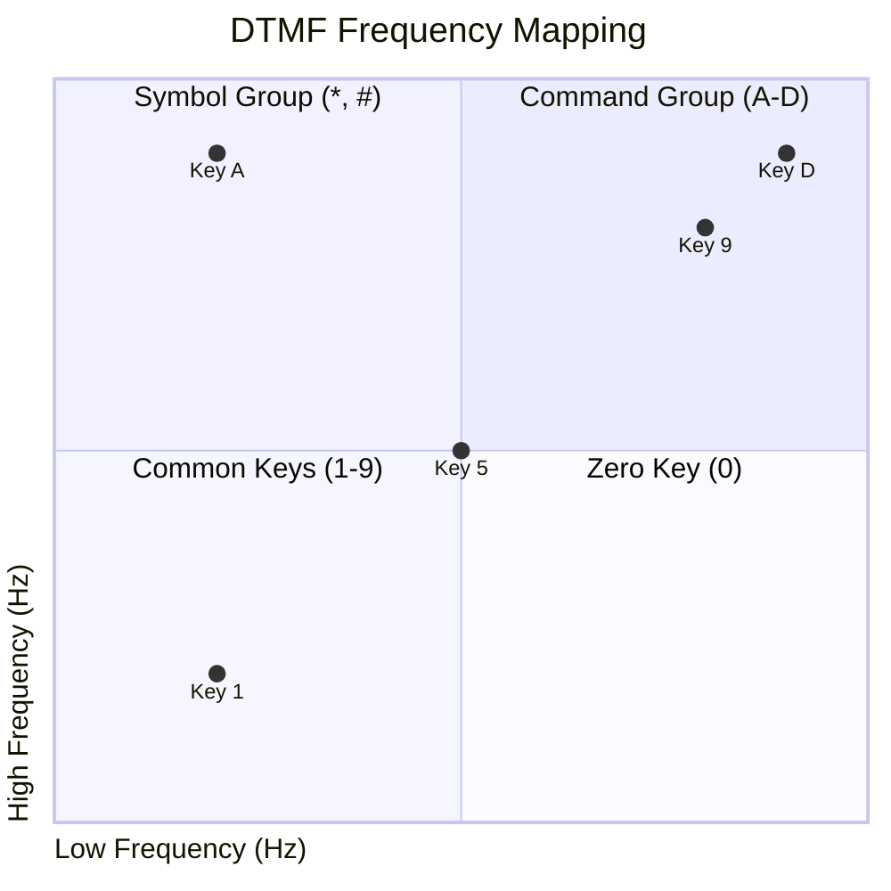
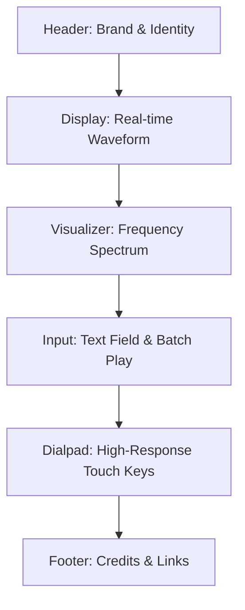

# 9M2PJU DTMF Code Simulator

A professional-grade, web-based DTMF (Dual-Tone Multi-Frequency) simulator designed for radio enthusiasts and telephony hobbyists.

**Live Link:** [https://dtmf.hamradio.my](https://dtmf.hamradio.my)

---

## 📻 How it Works

The 9M2PJU DTMF Simulator uses the **Web Audio API** to generate high-fidelity, real-time audio signals. Unlike simple recordings, this app synthesizes tones on-the-fly to ensure accuracy and low latency.

### The Audio Engine
1.  **Dual Oscillators**: Every key press triggers two simultaneous sine wave oscillators.
2.  **Harmonic Synthesis**: These waves are combined to create the unique "chord" characteristic of DTMF.
3.  **Telephone Filtering**: The combined signal passes through a bandpass filter (300Hz - 3400Hz) to replicate the acoustic properties of a traditional telephone line.
4.  **Envelope Control**: Exponential gain ramping is applied to prevent "clicks" or "pops" at the start and end of tones.

---

## 🏛️ History and Origin

### The Birth of Touch-Tone
DTMF was developed by **Bell System** (AT&T) in the late 1950s and officially introduced in **1963** as "Touch-Tone" dialing. Before DTMF, telephones used **pulse dialing**, which worked by physically interrupting the electrical circuit (the "click-click" sound of rotary phones). Pulse dialing was slow and prone to errors over long distances.

### Original Usage
Known as the **Blue Box** era, DTMF was the first step toward the digital age of telephony. It allowed users to send control signals across the network without operator intervention. The standard also included four additional keys—**A, B, C, and D**—which were originally used by the U.S. military (AutoVON network) for prioritizing calls.

---

## 🎯 Modern Usages

Today, DTMF remains a critical part of communication infrastructure:
-   **IVR Systems**: "Press 1 for Sales, 2 for Support."
-   **Amateur Radio**: Controlling repeaters, issuing remote commands, and EchoLink nodes.
-   **Home Automation**: Legacy security systems often use DTMF over telephone lines.
-   **Teleconferencing**: Entering PIN codes or muting/unmuting participants.

---

## 📊 Technical Specifications

DTMF works by mapping keys to a grid of "Low" and "High" frequencies. This cross-point system ensures that no frequency is a multiple of another, preventing voice signals from accidentally triggering the system.

### Frequency Matrix

| | 1209 Hz | 1336 Hz | 1477 Hz | 1633 Hz |
|---|:---:|:---:|:---:|:---:|
| **697 Hz** | 1 | 2 | 3 | A |
| **770 Hz** | 4 | 5 | 6 | B |
| **852 Hz** | 7 | 8 | 9 | C |
| **941 Hz** | * | 0 | # | D |

---

## 📐 Interface Layout

The app is optimized for a **Strict One-Page Fit**, meaning all components are visible on any screen without scrolling.

---

## 🛠️ Built With

-   **HTML5 / Semantic Tags**
-   **Vanilla CSS3** (dvh units, Flexbox, Glassmorphism)
-   **Vanilla JavaScript** (ES6+)
-   **Web Audio API**
-   **Canvas API** (Visualizations)

---
© 2026 [9M2PJU](https://hamradio.my) | Advanced Radio Toolkit
